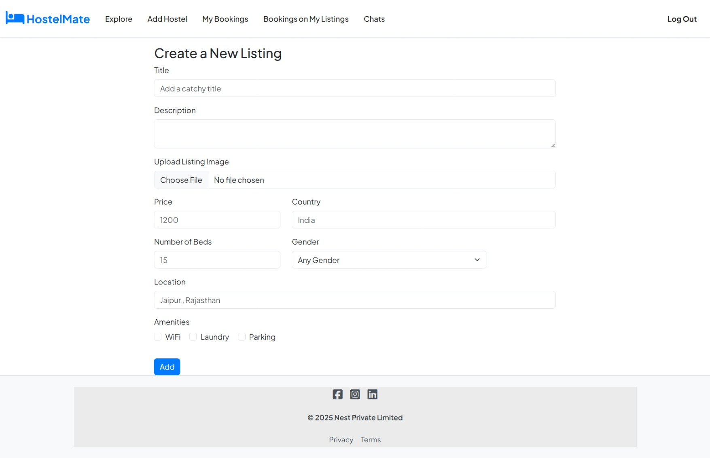
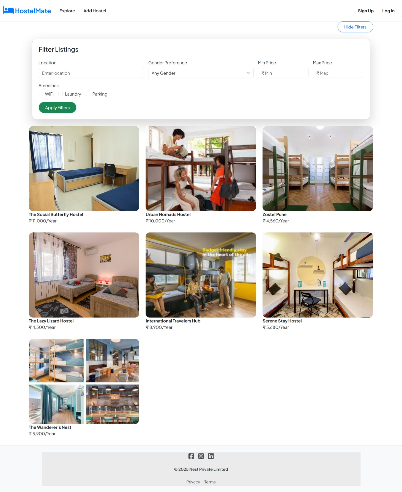
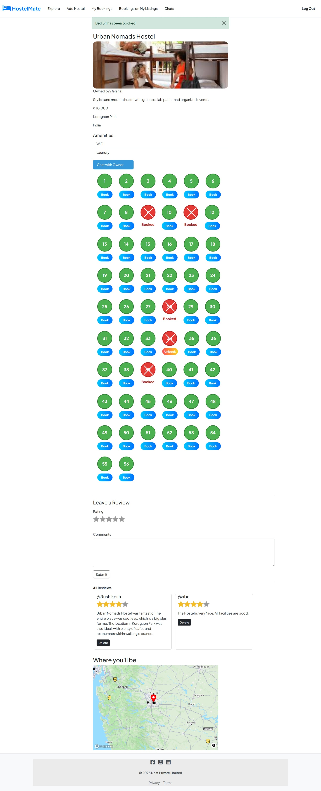
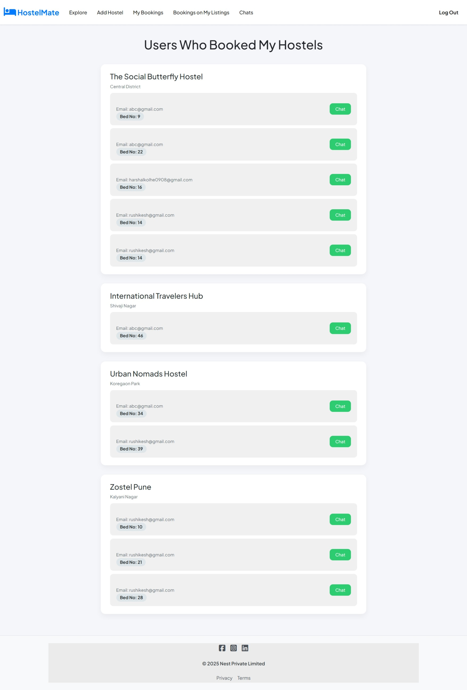
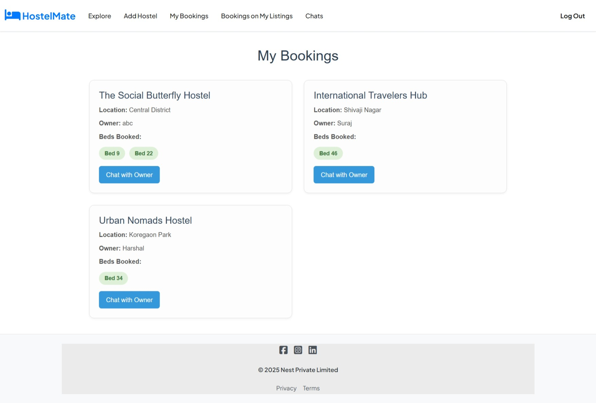

🏨 Hostel Mate – Hostel Booking Platform

🔗 Live Project: Hostel Mate

📌 Overview

Hostel Mate is a full-stack hostel booking platform that allows users to explore hostels, book beds, add their own hostels, leave reviews, and connect with owners. The platform ensures smooth user experience with authentication, validation, and real-time booking updates.

⚙️ Tech Stack

Frontend: EJS, Bootstrap, Starability CSS (for reviews)

Backend: Node.js, Express.js

Database: MongoDB

Authentication: Passport.js

Validation: Joi (backend schema validation), Bootstrap validation (frontend)

Cloud & APIs:

Cloudinary (image storage)

Mapbox (map integration)

Error Handling: Custom Error Handler, wrapAsync middleware

🌟 Features

1. 🏠 Index Page

Displays details about the application.

Login and Signup buttons available.

2. 🔍 Explore Hostels

Explore hostels with detailed listings.

Advanced filtering by price, amenities, location, and more.

 3. 📖 Hostel Detail Page

Complete hostel information (description, owner name, price, etc.).

Bed Dashboard:

Book available beds.

Unbook beds (if booked by the user or owner).

Review System:

Users can submit reviews with star ratings (Starability CSS).

All reviews displayed below.

Map Integration:

Location displayed via Mapbox.

4. ➕ Add Hostel Page

Hostel owners can add their hostel details.

Images stored securely in Cloudinary.

5. 👥 Users Who Booked My Hostel

Displays all users who booked beds in hostels owned by you.

Includes chat feature to contact them.

6. 🧑‍💼 Listing Owner Page

Displays all hostel owners whose hostels you have booked.

Chat feature available for direct communication.

✅ Key Highlights

Secure authentication with Passport.js.

Robust backend validation with Joi.

Frontend schema validation with Bootstrap.

Efficient error handling with wrapAsync and custom error classes.

Scalable image handling with Cloudinary.

Seamless maps integration using Mapbox.
